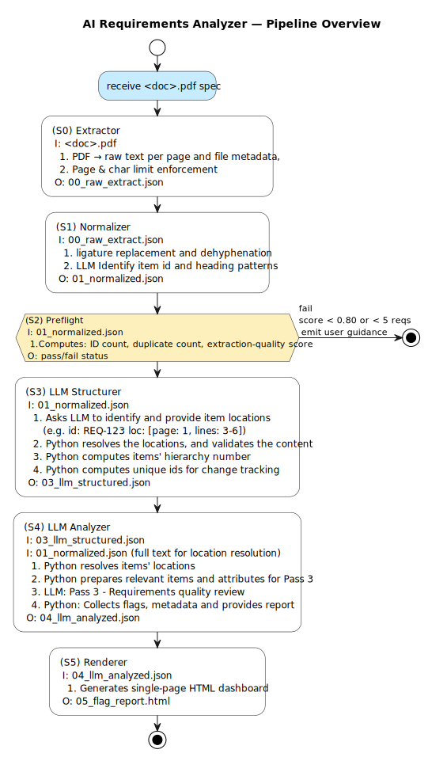

# reqs_analyzer

AI-powered review pipeline for embedded software and systems requirements documents.

Accepts a born-digital PDF specification, runs it through a deterministic preprocessing pipeline, then uses Claude (Anthropic) to structure its content and flag quality issues — producing a structured JSON output and (planned) an HTML report.

---

## Pipeline Overview



> Source: [`pipeline_overview_v1.puml`](architecture/pipeline_overview_v1.puml)

---

## Input Constraints (v1)

| Constraint     | Value                  |
|----------------|------------------------|
| Format         | Born-digital PDF       |
| Max pages      | 10                     |
| Max characters | 30,000                 |
| Requirement ID | `SYS-[A-Z]{2,8}-\d{3}` |

---

## Output Artifacts

Each stage writes an intermediate artifact to `pipeline_root/artifacts/<project>/`:

| File                    | Stage         | Contents                              |
|-------------------------|---------------|---------------------------------------|
| `00_raw_extract.json`   | S0 Extractor  | Per-page text, SHA-256, warnings      |
| `01_normalized_text.json` | S1 Normalizer | Cleaned text, normalization metadata |
| `02_after_preflight.json` | S2 Preflight  | Check results, score, gate decision  |
| `03_llm_structured.json`  | S3 Structurer | Structured spec with verbatim content resolved from loc coordinates |
| `04_llm_analyzed.json`    | S5 Analyzer   | Flags, statistics, AI analysis summary |
| `05_report.html`          | S6 Renderer   | Human-readable report                |

---

## Requirements

- Python 3.11+
- An [Anthropic API key](https://console.anthropic.com)

---

## Setup

```bash
git clone <repo-url>
cd reqs_analyzer

python -m venv venv
source venv/bin/activate      # Windows: venv\Scripts\activate
pip install -r requirements.txt

cp .env.example .env
# Edit .env and add your ANTHROPIC_API_KEY
```

---

## Usage

Run each stage from `pipeline_root/`:

```bash
cd pipeline_root

# S0 — Extract text from PDF
python src/S0_extractor.py input/<project>/<spec>.pdf

# S1 — Normalize extracted text
python src/S1_normalizer.py artifacts/<project>/00_raw_extract.json

# S2–S5 — In development (see Status below)
```

---

## Project Structure

```
reqs_analyzer/
  architecture/           Architecture diagrams and design docs (PlantUML)
  pipeline_root/
    src/
      S0_extractor.py     Stage 0 — PDF text extraction
      S1_normalizer.py    Stage 1 — Text normalization
      S2_preflight.py     Stage 2 — Preflight gate
      S3_llm_structurer.py  Stage 3 — LLM structuring + content resolution
      S5_llm_analyzer.py  Stage 5 — LLM analysis (planned)
      S6_renderer.py      Stage 6 — Report rendering (planned)
      prompts/            LLM prompt definitions
    artifacts/            Intermediate JSON outputs (gitignored in production)
    input/                Input PDF specs — see input/arvms_specs/ for examples
    tests/                Test plans and test inputs
  requirements.txt
  .env.example
```

---

## Status

| Stage | Name         | Status       |
|-------|--------------|--------------|
| S0    | Extractor      | Complete |
| S1    | Normalizer     | Complete |
| S2    | Preflight      | Complete |
| S3    | LLM Structurer | Complete |
| S5    | LLM Analyzer   | Planned  |
| S6    | Renderer       | Planned  |

---

## Domain Context

This tool is designed for embedded systems and safety-critical software engineering, targeting documents that follow standards such as ISO 26262 and ASPICE. The LLM analysis prompt is scoped to flag:

- Verifiability / testability issues
- Ambiguity and underspecification
- Missing safety or ASIL context
- Traceability gaps
- Consistency problems across requirements

---

## License

MIT — see [LICENSE](LICENSE)

---

## uthor

This project was developed by Jair Jimenez, Systems & Software Architect 
specialized in AI-augmented embedded and safety-critical system development with ADAS expertise.

For consulting, customization, or enterprise integration inquiries:
📩 jairjimenezv@gmail.com
🌐 linkedin.com/in/jairjimenezv